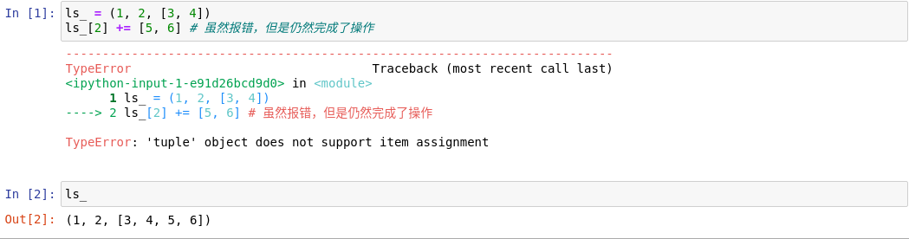

## 内置序列类型

+ 容器序列：
  + `list`
  + `tuple`
  + `collections.deque`

容器序列存放的是他们所包含的任意类型的**对象的引用**。

+ 扁平序列：
  + `str`
  + `bytes`
  + `bytearray`
  + `memoryview`
  + `array.array`

扁平序列存放的**是值而不是引用**。

---

## 列表推导

### 目的

列表推导的目的只有一个：生成列表。

## 生成器表达式

生成器表达式的语法跟列表推导差不多，只不过把方括号换成了圆括号而已。但与列表推导不同的是，生成器表达式背后遵守了迭代器协议，可以逐个地产出元素，而不是先建立一个完整的列表。

---

## 对序列使用`+`和`*`

通常`+`号两侧的序列由相同的数据类型所构成，在拼接的过程中，两个被操作的序列都不会被修改，Python会新建一个包含同样数据类型数据的序列作为拼接的结果。

对不可变序列进行拼接操作，效率很低。因为每次都会有一个新的对象，解释器需要先把原来对象中元素都复制一份，然后再最追加新的元素。**虽然`str`类型为不可变对象，但由于对其的追加操作比较频繁，Python对其进行了特殊优化。**

---

## 序列对象的增量操作(`+=` / `*=`)

不要把可变对象放在元组里面！！！

把不可变对象`tuple`放到可变的容器对象`list`中，对元组进行修改会抛出异常，但是在内部Python仍然执行了操作。

---

## 序列元素排序及查找

### 排序

+ `sort(key, reverse)`
+ `sorted(key, reverse)`

### 查找

+ `bisect`模块：Python内置的二分查找算法，用来对**有序**序列元素的查找和插入。
+ `bisect.bisect()`\[或者`bisect.bisect_left()`\]可以用来代替`index`方法在有序的长序列中快速查找一个元素的位置。
+ 使用`bisect.insort()`对列表进行扩充，可以一直维持列表的有序状态.

---

## array

使用内置的`array`模块，可像使用C语言的`array`那样使用数组。
保存一个纯数据类型的文件时，尽量保存为二进制文件(`'.bin'`)，这样可被快速读取。如果将数据保存为文本文件，在读取的时候会进行强制类型转换，比较耗费时间。
