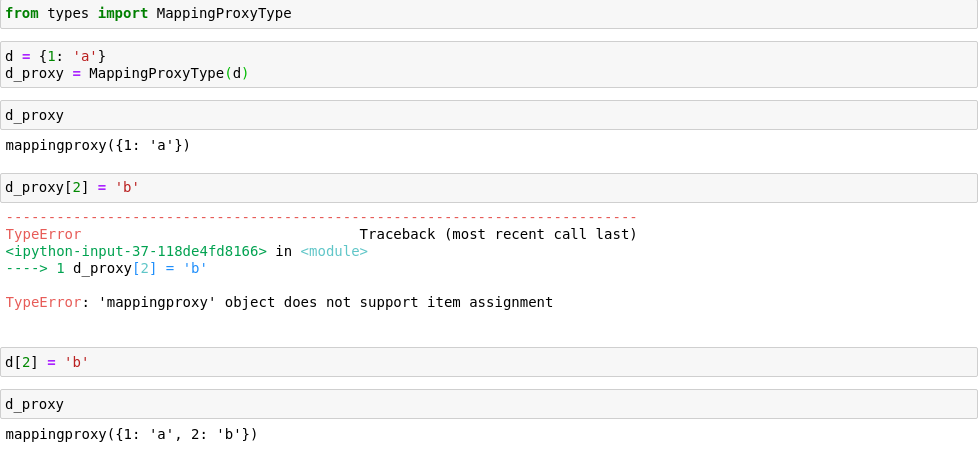

## dict

`my_dict.setdefault(key, []).append(new_value)`

使用`setdefault()`方法可避免多次键查找。

---

## 不可变的dict

标准库中的所有映射类型都是可变的，但是可以通过`types.MappingProxyType`，返回一个只读的映射视图。

+ 不能通过经过`MappingProxyType`包装的`dict_proxy`对其进行修改
+ 但是修改源`dict`也能反映到`dict_proxy`，所以说`MappingProxyType`返回的仅仅是代理

### 注意事项

+ 字典浪费存储空间(不过没有几百万对象,内存好几个G不用考虑).`dict` 的实现是典型的空间换时间：字典类型有着巨大的内存开销
+ **不要对字典同时进行迭代和修改**。如果想扫描并修改一个字典，最好分成两步来进行：
  + 首先对字典迭代，以得出需要添加的内容，把这些内容放在一个新字典里；
  + 迭代结束之后再对原有字典进行更新。

---

## set

### 集合的运算操作

在使用中缀运算符(`+, -, &, |, ^`)时，要求运算符两边都为`set`类型。其它所有方法(`union(), intersection(), update(), difference(), ...`)只要求所传入的参数是可迭代对象即可。

### 集合的比较操作

+ `in`
+ `<=`
+ `<`
+ `>=`
+ `>`

### 其他方法

+ `add()`
+ `clear()`
+ `copy()`：浅复制
+ `s.discard(e)`：如果集合s中有元素e的话，就把e从s中删除，不存在时不会抛出异常
+ `len()`
+ `pop()`
+ `s.remove(e)`: 元素e存在，就将其移除，不存在就抛出`KeyError`
