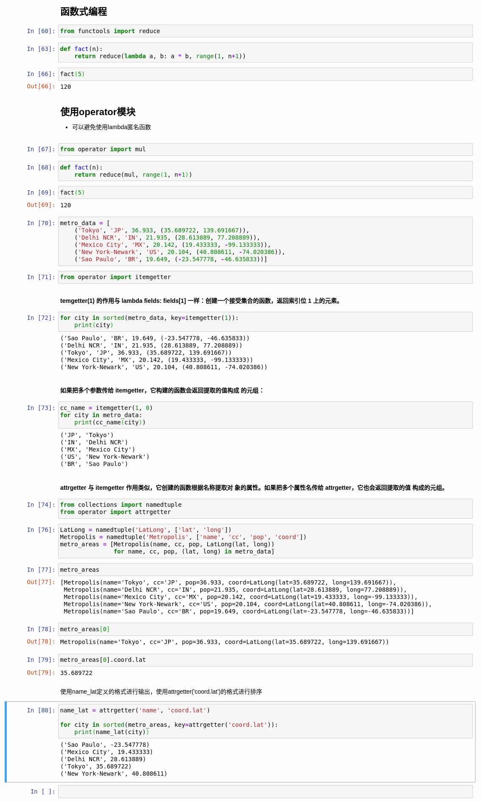

## 高阶函数

接受函数作为参数，或者把函数作为结果返回的函数是高阶函数(higher-order function).例如：`map()`，`filter()`,`reduce()`。

### 常规对象没有而函数有的属性

+ `'__annotations__'`,参数和返回值的注解
+ `'__call__'`,实现 () 运算符[函数对象默认是可调用的]
+ `'__closure__'`,函数闭包，即自由变量的绑定（通常是 None）
+ `'__code__'`,编译成字节码的函数元数据和函数定义体
+ `'__defaults__'`,形式参数的默认值 
+ `'__get__'`,实现只读描述符协议
+ `'__globals__'`,函数所在模块中的全局变量 
+ `'__kwdefaults__'`,仅限关键字形式参数的默认值
+ `'__name__'`,函数名称
+ `'__qualname__'`，函数的限定名称

---

## 仅限关键字参数

定义函数时若要指定**仅限关键字参数**，要把它们放到前面有`'*'`的参数后面。如果不想支持数量不定的定位参数，但是想支持仅限关键字参数，在签名中放一个`'*'`。

``` Python
def func(a, *, b):
    return a, b

# 不指定关键字传入参数
In[]:func(1, 2)
---------------------------------------------------------------------------
TypeError                                 Traceback (most recent call last)
<ipython-input-19-e7c1b843e414> in <module>
      2     return a, b
      3 
----> 4 f(1, 2)

TypeError: f() takes 1 positional argument but 2 were given

# 指定关键字传入参数
In[]:func(1, b=2)
1, 2
```

也就是说必须指定关键字参数`b`并传入参数才行。

---

## str.rfind()

 `rfind()` 返回字符串最后一次出现的位置(从右向左查询)，如果没有匹配项则返回`-1`。

 `str.rfind(str, beg=0 end=len(string))`

参数:

+ str -- 查找的字符串
+ beg -- 开始查找的位置，默认为 0
+ end -- 结束查找位置，默认为字符串的长度。

## str.find()

`find()` 方法检测字符串中是否包含子字符串 `str` ，如果指定`beg`（开始） 和 `end`（结束） 范围，则检查是否包含在指定范围内，如果包含子字符串返回开始的索引值，否则返回`-1`。

`str.find(str, beg=0, end=len(string))`

参数:

+ str -- 指定检索的字符串
+ beg -- 开始索引，默认为0。
+ end -- 结束索引，默认为字符串的长度。

注意，使用`str.find()`和`str.rfind()`时不可以传入关键字参数，即：

``` Python
str1 = "this is string example....wow!!!"
str2 = "exam"

In[]:str1.find(str2)
15

In[]:str1.rfind(str2, 20)
-1

# 不能使用如下的调用方式
In[]:str1.rfind(str2, start=20)
---------------------------------------------------------------------------
TypeError                                 Traceback (most recent call last)
<ipython-input-45-03aac63a2bf3> in <module>
----> 1 str1.rfind(str2, start=20)

TypeError: rfind() takes no keyword arguments
```
---

## 函数注解

Python对注解所做的唯一的事情是，把他们存储在函数的`__annotations__`属性里.仅此而已，Python不做检查，不做强制，不做验证，什么都不做。

如果参数有默认值，注解放在参数名和`'='`之间。注解常用的类型是类(如:`str`, `int`等)和字符串(`'int > 0'`)。

``` python
def clip(text: str, max_len: 'int > 0' = 10) -> str:
    end = None
    if len(text) > max_len:
        space_before = text.rfind(' ', 0, max_len)
        if space_before >= 0:
            end = space_before
        else:
            space_after = text.rfind(' ', max_len)
            if space_after >= 0:
                end = sapce_after
    if end is None:
        end = len(text)
    return text[:end].rstrip()
```

## 函数式编程



### methodcaller

``` python
In[]:s = 'The time has come'
In[]:str.upper(s)
'THE TIME HAS COME'
In[]:from operator import methodcaller
In[]:upcase = methodcaller('upper')
In[]:upcase(s)
'THE TIME HAS COME'
```

`methodcaller`会自行创建与传入参数(字符串)同名的函数，并在对象上调用它。

``` python
In[]:hiphenate = methodcaller('replace', ' ', '_')
In[]:hiphenate(s)
Out[]:
'The_time_has_come'
```

从上面的栗子可以看到，`methodcaller`还可以冻结某些参数，与`functools.partial`函数的作用类似。

## functools.partial

``` python
In[]:import unicodedata
In[]:nfc = partial(unicodedata.normalize, 'NFC')
In[]:s1 = 'café'
In[]:s2 = 'cafe\u0301'
In[]:s1 == s2
False
In[]:nfc(s1) == nfc(s2)
True
```
