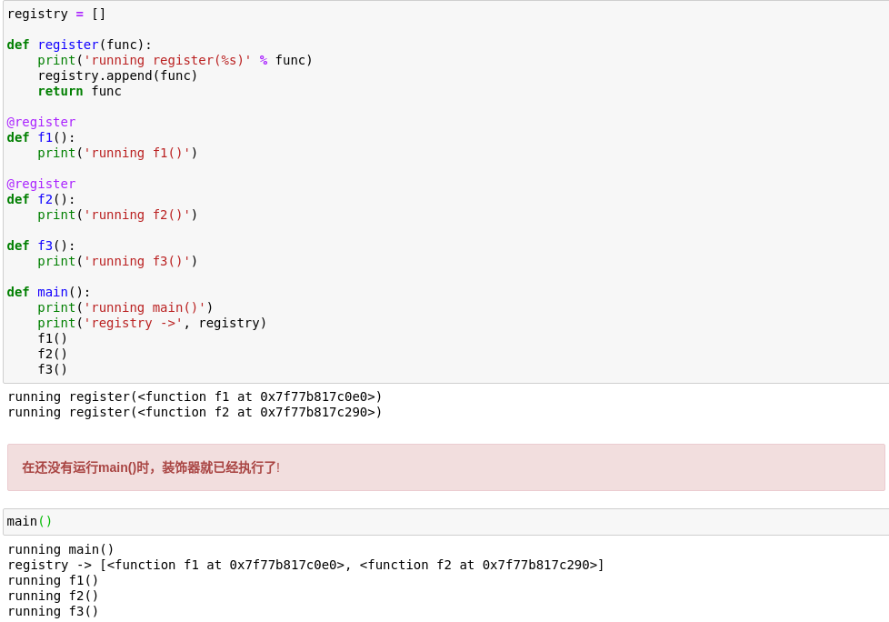
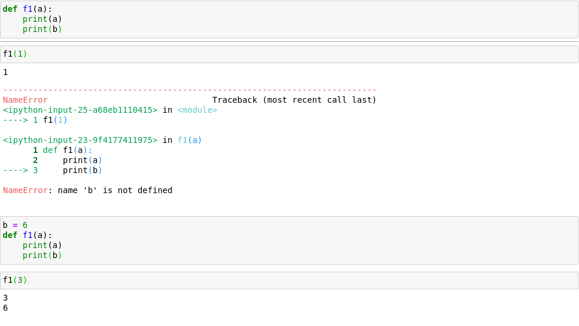
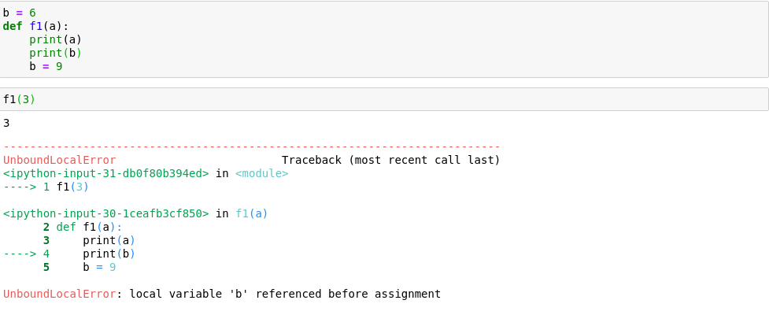

# 装饰器

装饰器通常的行为：把被装饰的函数替换成新函数，二者接受相同的参数，而且通常返回被装饰函数本该返回的值，同时还会做些额外操作。

---

## 装饰器在何时运行



---

## 变量作用域



---

在函数体中找不到局部变量`b`，python默认使用名称为`b`的全局变量



同样的，在函数体中找不到局部变量`b`，但是Python在编译函数的定义体时，它判断`b`是局部变量，因为在函数体中给它赋值了！！！

**Python不要求声明变量，但是假定在函数定义体中赋值的变量是局部变量**

---

## 闭包

**闭包指延伸了作用域的函数!**

### 自由变量

**自由变量：指未在本地作用域中绑定的变量!**

```python
def make_averager():
    series = []

    def averager(new_value):
        # 如果series为不可变类型(str, tuple, int,..)那么程序会无法执行
        series.append(new_value)  
        total = sum(series)
        return total / len(series)

    return averager
```

对于`averager`函数来说，变量`series`就为自由变量。

```python
if '__name__' == __main__:
    avg = make_averager()
    print(avg(1))
    print(avg(2))
```

输出结果：

```Python
1.0
1.5
```

### nonlocal

**`nonlocal`：把变量（代表不可变类型的变量）标记为自由变量!**

```python
def make_averager():
    count = 0
    total = 0

    def averager(new_value):
        # 如果为count赋值，Python就认为它为局部变量而非自由变量
        count += 1
        total += new_value  # 同理
        return total / count
    return averager


if '__name__' == __main__:
    avg = make_averager()
    print(avg(1))
    print(avg(2))
```

输出结果：

```Python
---------------------------------------------------------------------------
UnboundLocalError                         Traceback (most recent call last)
<ipython-input-50-4e2b6817fa3a> in <module>
      1 avg = make_averager()
----> 2 avg(12)

<ipython-input-49-ad7ccdcd3a47> in averager(new_value)
      4
      5     def averager(new_value):
                # 如果为count赋值，Python就认为它为局部变量而非自由变量
----> 6         count += 1  
      7         total += new_value  # 同理
      8         return total / count

UnboundLocalError: local variable 'count' referenced before assignment
```

使用`nonlocal`修改上面的程序：

```Python
def make_averager():
    count = 0
    total = 0

    def averager(new_value):
        # 使用nonlocal显式指定count和total为自由变量
        nonlocal count, total
        count += 1  
        total += new_value  
        return total / count
    return averager


if '__name__' == __main__:
    avg = make_averager()
    print(avg(1))
    print(avg(2))
```

输出结果：

```Python
1.0
1.5
```

---

## 内置好用的装饰器

### functools.wraps()

+ **`functools.wraps` 旨在消除装饰器对原函数造成的影响，即对原函数的相关属性进行拷贝，以达到装饰器不修改原函数的目的。**
+ `wraps`内部通过`partial`对象和`update_wrapper`函数实现。
+ `partial`是一个类，通过实现了`__new__`方法，自定义实例化对象过程，使得对象内部保留原函数和固定参数，通过实现`__call__`方法，使得对象可以像函数一样被调用，再通过内部保留的原函数和固定参数以及传入的其它参数进行原函数调用。

```python
import functools
import sys

def trace(func):
    def callf(*args, **kwargs):
        """A wrapper function."""
        debug_log.write('Calling function: {}\n'.format(func.__name__))
        res = func(*args, **kwargs)
        debug_log.write('Return value: {}\n'.format(res))
        return res
    return callf


@trace
def square(x):
    """Calculate the square of the given number."""
    return x * x
```

查看被装饰的函数`square()`:

```python
print(help(square))
print(square.__doc__)
```

输出：

```python
Help on function callf in module __main__:

callf(*args, **kwargs)
    A wrapper function.

-----------------------------------------------
A wrapper function.
```

可以看到，经过装饰器修饰后的`square()`函数的属性被改变了，现在的`square()`函数被`callf()`函数代替了。

使用`functools.wraps`装饰器：

```Python
from functools import wraps

def trace(func):
    @functools.wraps(func)
    def callf(*args, **kwargs):
        """A wrapper function."""
        debug_log.write('Calling function: {}\n'.format(func.__name__))
        res = func(*args, **kwargs)
        debug_log.write('Return value: {}\n'.format(res))
        return res
    return callf

@trace
def square(x):
    """Calculate the square of the given number."""
    return x * x
```

测试：

```pyhton
print(help(square))
print(square.__doc__)
```

输出：

```python
Help on function square in module __main__:

square(x)
    Calculate the square of the given number.

----------------------------------------------------
None
Calculate the square of the given number.
```

通过`functools.wraps`装饰器，函数（`square()`）在装饰前后的所有信息保持不变。

[Reference](https://www.cnblogs.com/myd7349/p/how_to_use_wraps_of_functools.html)

### functools.lru_cache()

lru: `L`east `R`ecently `U`sed

该装饰器把耗时的函数的结果保存起来，避免传入相同的参数时重复计算。

普通的计算fibonacci的程序：

```python
import time

def clock_1(func):
    print('running decorate')
    def clocked(*args):
        t0 = time.perf_counter()
        result = func(*args)
        elapsed = time.perf_counter() - t0
        name = func.__name__
        arg_str = ', '.join(repr(arg) for arg in args)
        print('[%0.8fs] %s(%s) -> %r' % (elapsed, name, arg_str, result))
        return result
    return clocked

@clock_1
def fibonacci(n):
    if n < 2:
        return n
    return fibonacci(n-2) + fibonacci(n-1)

if '__name__' == __main__:
    print(fibonacci(6))
```

输出结果：

```Python
running decorate
[0.00000029s] fibonacci(0) -> 0
[0.00000033s] fibonacci(1) -> 1
[0.00003366s] fibonacci(2) -> 1
[0.00000018s] fibonacci(1) -> 1
[0.00000024s] fibonacci(0) -> 0
[0.00000018s] fibonacci(1) -> 1
[0.00002258s] fibonacci(2) -> 1
[0.00004388s] fibonacci(3) -> 2
[0.00021210s] fibonacci(4) -> 3
[0.00000021s] fibonacci(1) -> 1
[0.00000027s] fibonacci(0) -> 0
[0.00000023s] fibonacci(1) -> 1
[0.00002334s] fibonacci(2) -> 1
[0.00004793s] fibonacci(3) -> 2
[0.00000018s] fibonacci(0) -> 0
[0.00000020s] fibonacci(1) -> 1
[0.00002182s] fibonacci(2) -> 1
[0.00000016s] fibonacci(1) -> 1
[0.00000026s] fibonacci(0) -> 0
[0.00000018s] fibonacci(1) -> 1
[0.00002144s] fibonacci(2) -> 1
[0.00004306s] fibonacci(3) -> 2
[0.00008650s] fibonacci(4) -> 3
[0.00116955s] fibonacci(5) -> 5
[0.00143348s] fibonacci(6) -> 8
8
```

重复计算了很多之前计算过的结果。

使用`functools.lru_cache()`:

```python
@functools.lru_cache()
@clock_1
def fibonacci(n):
    if n < 2:
        return n
    return fibonacci(n-2) + fibonacci(n-1)

if '__name__' == __main__:
    print(fibonacci(6))
```

输出结果：

```Python
running decorate
[0.00000031s] fibonacci(0) -> 0
[0.00000033s] fibonacci(1) -> 1
[0.00003691s] fibonacci(2) -> 1
[0.00000046s] fibonacci(3) -> 2
[0.00032210s] fibonacci(4) -> 3
[0.00000062s] fibonacci(5) -> 5
[0.00036906s] fibonacci(6) -> 8
8
```

**测试的n越大，加速效果越明显。**

特别要注意，`lru_cache` 可以使用两个可选的参数来配置:

```python
functools.lru_cache(maxsize=128, typed=False)
```

`maxsize`参数指定存储多少个调用结果。缓存满了之后，旧的结果会被抛弃，腾出空间。为了得到最佳性能，**`maxsize`应该设置为2的幂**。`typed`参数如果设置为`True`，会把不同参数类型得到的结果分开保存。

### functools.singledispatch()

**根据第一个参数的类型，以不同的方式执行相同操作的一组函数。**

Python中多个具有相同函数名称的函数在执行时会被最后一个函数所覆盖。如果要实现一个函数，该函数的主体功能都是类似的，只是需要随着输入参数类型的变化有稍微的改动。

方法一：

使用一连串的`if`, `elif` , `else`来实现：

```python
import numbers

def printf_1(obj):
    if isinstance(obj, str):
        print("print string")
    elif isinstance(obj, numbers.Integral):
        print("print integrial")
    elif isinstance(obj, tuple):
        print("print sequence")
    else:
        print("Base printf")

if '__name__' == __main__:
    printf_1(1)
    printf_1('a')
    printf_1((1,))
    printf_1(1.5)
```

输出：

```Python
print integrial
print string
print sequence
Base printf
```

方法二：

使用`functools.singledispath()`装饰器：

```python
from functools import singledispatch
import numbers

@singledispatch
def printf(obj):
    print("Base printf")

@printf.register(str)
def _(text):
    print("print string")

@printf.register(numbers.Integral)
def _(n):
    print("print intergrial")

@printf.register(tuple)
def _(seq):
    print("print sequence")


if '__name__' == __main__:
    printf_1(1)
    printf_1('a')
    printf_1((1,))
    printf_1(1.5)
```

输出：

```Python
print integrial
print string
print sequence
Base printf
```

## 装饰器的堆叠

```python
@d1
@d2
def f():
    pass
```

等同于：

```python
def f():
    pass

f = d1(d2(f))
```

---

## 参数化的注册装饰器

```python
registry = set()

def register(active=True):
    # decorate才是真正的装饰器，接受一个function object作为参数
    def decorate(func):  
        print('running register(active=%s) -> decorate(%s)' % (active, func))
        if active:
            registry.add(func)
        else:
            registry.discard(func)
        return func
    return decorate

@register(active=False)  # register必须作为函数的形式调用
def f1():
    print('running f1()')

@register()  # 即使不传入参数，register也必须作为函数的形式调用
def f2():
    print('running f2()')

def f3():
    print('running f3()')
```

**`register`是装饰器工厂函数，因此必须返回`decorate`，这是实现参数化的装饰器的关键。**

`@register`工厂函数必须作为函数调用，并且传入参数(如果有的话)，即使不传入参数，`register`也必须作为函数调用。

上面的参数化的注册装饰器本身带有参数，也可以接受被装饰函数的参数，但是无法对被装饰函数的参数进行处理，因为`decorate`必须接受一个`function object`作为参数。

## 参数化的装饰器

**参数化的装饰器与参数化的注册装饰器的区别是：参数化的装饰器可以同时拥有装饰器本身的参数和被装饰函数的参数。**

```python
import time
from pprint import pprint
DEFAULT_FMT = '[{elapsed:0.8f}s] {name}({args}) -> {result}'

def clock(fmt=DEFAULT_FMT):
    def decorate(func):
        def clocked(*_args):
            t0 = time.time()
            _result = func(*_args)
            elapsed = time.time() - t0
            name = func.__name__
            args = ', '.join(repr(arg) for arg in _args)
            result = repr(_result)
            print(fmt.format(**locals()))
            print('-'*100)
            pprint('locals: %r' % (dict(**locals())))
            return _result
        return clocked
    return decorate

@clock()
def snooze_1(second):
    time.sleep(second)

@clock('{name}: {elapsed}s')
def snooze_2(seconds):
    time.sleep(seconds)

@clock('{name}({args}) dt={elapsed:0.3f}s')
def snooze(_3seconds):
    time.sleep(seconds)


if '__name__' == __main__:
    snooze_1(0.123)
    snooze_2(0.123)
    snooze_3(0.123)
```

如果你想的话，还可以在`clocked`函数内部对传入的被装饰函数的参数再进行处理。

输出：

```Python
[0.12316847s] snooze(0.123) -> None
----------------------------------------------------------------------------------------------------
("locals: {'_args': (0.123,), 't0': 1585557124.095131, '_result': None, "
 "'elapsed': 0.1231684684753418, 'name': 'snooze', 'args': '0.123', 'result': "
 "'None', 'fmt': '[{elapsed:0.8f}s] {name}({args}) -> {result}', 'func': "
 '<function snooze at 0x7fddb18fab90>}')

 snooze: 0.12317037582397461s
----------------------------------------------------------------------------------------------------
("locals: {'_args': (0.123,), 't0': 1585557127.1343677, '_result': None, "
 "'elapsed': 0.12317037582397461, 'name': 'snooze', 'args': '0.123', 'result': "
 "'None', 'fmt': '{name}: {elapsed}s', 'func': <function snooze at "
 '0x7fddb18fa170>}')

 snooze(0.123) dt=0.123s
----------------------------------------------------------------------------------------------------
("locals: {'_args': (0.123,), 't0': 1585557336.5371945, '_result': None, "
 "'elapsed': 0.12317204475402832, 'name': 'snooze', 'args': '0.123', 'result': "
 "'None', 'fmt': '{name}({args}) dt={elapsed:0.3f}s', 'func': <function snooze "
 'at 0x7fddb18faf80>}')
```

---

## 使用class创建装饰器

**推荐使用`class`通过实现`__call__()`方法的方式构建装饰器。**

```Python
class Clock:
    DEFAULT_FMT = '[{elapsed:0.8f}s] {name}({args}) -> {result}'
    def __init__(self, fmt=DEFAULT_FMT):
        self.fmt = fmt

    def __call__(self):
        def decorate(func):
            def clocked(*_args):
                t0 = time.time()
                _result = func(*_args)
                elapsed = time.time() - t0
                name = func.__name__
                args = ', '.join(repr(arg) for arg in _args)
                result = repr(_result)
                print(self.fmt.format(**locals()))
                print('-'*100)
                pprint('locals: %r' % (dict(**locals())))
                return _result
            return clocked
        return decorate


clock_decorate = Clock()

@clock_decorate()
def snooze(seconds):
    time.sleep(seconds)


if '__name__' == __main__:
    snooze(0.123)
```

输出：

```Python
[0.12316871s] snooze(0.123) -> None
----------------------------------------------------------------------------------------------------
("locals: {'_args': (0.123,), 't0': 1585558033.6486115, '_result': None, "
 "'elapsed': 0.1231687068939209, 'name': 'snooze', 'args': '0.123', 'result': "
 "'None', 'func': <function snooze at 0x7fddb1649a70>, 'self': <__main__.Clock "
 'object at 0x7fddb1b76550>}')
```
