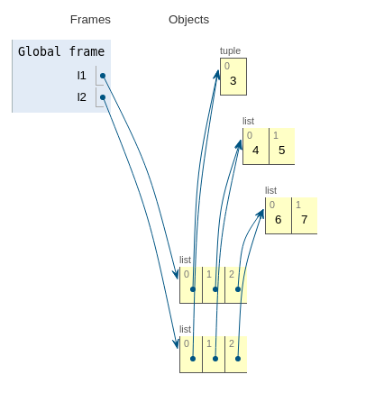
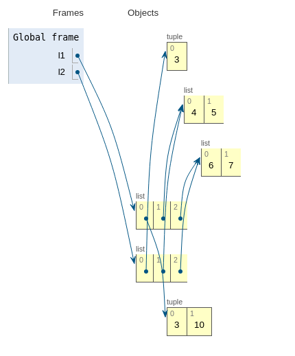
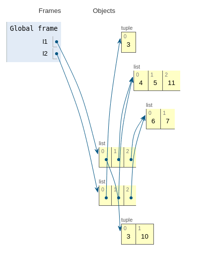
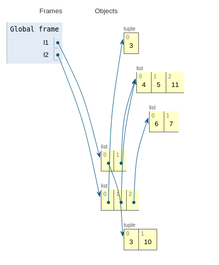
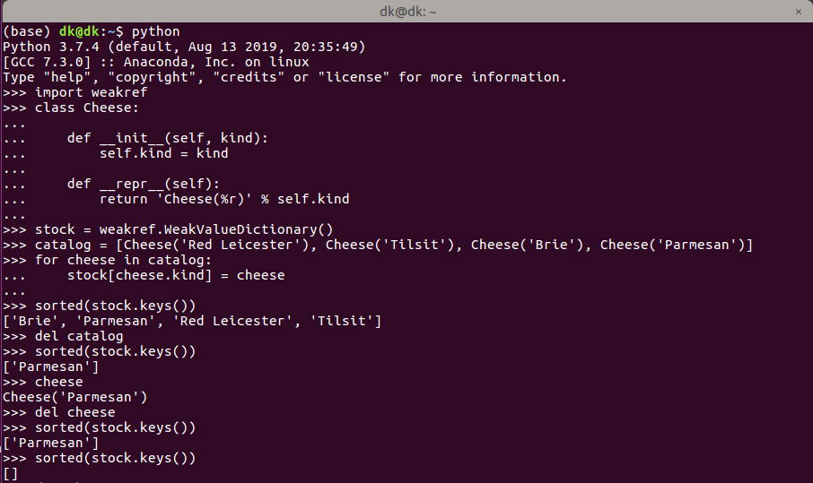

## 对象、变量、别名

+ 对象是实际存放数据的一块内存空间
+ 变量只不过贴在对象上的一个标注
+ 一个对象可以有多个标注，这些标注，就是别名

每个变量都有标识、类型和值。对象一旦创建，它的标识绝不会变，你可以把标识理解为对象在内存中的地址。`is`运算符比较两个对象的标识。`id()`函数返回对象标识的整数表示。`'=='`运算符比较两个对象的值(对象中保存的数据)。

---

## 元组

元组与多数Python集合(列表、字典、集合，等等)一样，保存的是对象的引用。如果引用的元素是可变的，即便元组本身不可变，元组依然可变。也就是说，元组的不可变性其实指的是`tuple`数据结构的物理内容(即保存的引用)不可变，与引用的对象无关。

---

## 浅复制

```python
l1 = [(3,), [4, 5], [6, 7]]
l2 = list(l1)
```

`l1`和`l2`各个元素均是某个对象的引用，对于`l1`和`l2`来说，各自需要一块内存存放各自的引用，因此: $id(l1) \neq id(l2)$。



```python
l1[0] += (10,)
```



`l1`和`l2`的第一个元素的引用指向的是一个不可变类型(`tuple`)，改变`l1`的第一个元素时，会另开辟一块内存空间，从而不对`l2`中对应元素产生影响。

```python
l1[1].append(11)
```



`l1`和`l2`的第二个元素的引用指向的是一个可变类型(`list`)，当对`l1`的第二个元素进行改变时，同时也影响`l2`中对应的引用。

```python
l1.remove([6, 7])
```



由于`l1`和`l2`各自元素(各个对象的引用)位于不同的内存区域，删除`l1`中的某个引用，不会对`l2`中对应位置上的引用造成影响。

---

## 不要使用可变类型作为可选参数的默认值

```python
class HauntedBus:

    def __init__(self, passengers=[]):
        self.passengers = passengers

    def pick(self, name):
        self.passengers.append(name)

    def drop(self, name):
        self.passengers.remove(name)


if "__name__" == __main__:
    bus1 = HauntedBus(['Alice', 'Bill'])
    print("bus1's passengers: ", bus1.passengers)
    bus2 = HauntedBus()
    print("bus2's passengers: ", bus2.passengers)
    bus2.pick('Tom')
    print("bus2's passengers: ", bus2.passengers)
    bus3 = HauntedBus()
    print("bus3's passengers: ", bus3.passengers)
```

输出：

```Python
bus1's passengers: ['Alice', 'Bill']
bus2's passengers: []
bus2's passengers: ['Tom']
bus3's passengers: ['Tom']
```

**除非这个方法确实想修改通过参数传入的对象，否则在类中直接把参数赋值给实例变量之前一定要三思，因为这样会为参数对象创建别名。如果不确定，那就创建副本。**

---

## del

+ **`del`命令不删除对象，而是删除对象的引用**
+ 自己编写的代码很少需要实现`__del__`
+ 当一个变量保存的是某个对象的最后一个引用，此时使用`del`删除该变量时，才会导致该对象被销毁

```python
import weakref

s1 = {1, 2, 3}
s2 = s1

def bye():
    print('Gone with the wind...')

ender = weakref.finalize(s1, bye)  # 为s1所引用的对象上注册回调函数
print(ender.alive)  # output: True
del s1
print(ender.alive)  # output: True / del删除的s1这个引用而非对象，执行完'del s1'后仍有's2'这个变量指向'{1, 2, 3}'
s2 = 'spam'  # output: Gone with the wind... / 修改对象{1, 2, 3}的最后一个引用s2，此时启动了bye回调，ender.alive的值变成了True
print(ender.alive)  # output: False
```

---

## 弱引用

弱引用不会增加对象的引用数量，不妨碍所指对象被当做垃圾回收。弱引用是可调用的对象，返回的是被调用的对象，如果所指对象不存在了，返回`None`。

### WeakValueDictionary

`WeakValueDictionary`类实现的是一种可变映射，里面的值是对象的弱引用。被引用的对象在程序中的其它地方被当做垃圾回收后，对应的键会自动从`WeakValueDictionary`中删除。因此，`WeakValueDictionary`经常用于缓存。



`for`循环中的变量`cheese`是全局变量，除非显式删除，否者不会消失。

与 `WeakValueDictionary` 对应的是 `WeakKeyDictionary`，后者的键是弱引用。

`weakref`模块还提供了`WeakSet`类，按照文档的说明，这个类的作用很简单：“保存元素弱引用的集合类。元素没有强引用时，集合会把它删除。”如果一个类需要知道所有实例，一种好的方案是创建一个`WeakSet`类型的类属性，保存实例的引用。

不是每个Python对象都可以作为弱引用的目标。基本的`list`和`dict`实例不能作为所指对象，但他们的子类可以。`int`和`tuple`实例不能作为弱引用的目标，甚至它们的子类也不行。

`set`实例以及用户自定义的类型可以作为弱引用的目标。

## 总结

1. 如果两个变量指代的不可变对象具有相同的值（`a == b`为`True`），实际上它们指代的是副本还是同一个对象的别名基本没什么关系，因为不可变对象的值不会变，但有一个例外。这里说的例外是不可变的集合， 如元组和`frozenset`：如果不可变集合保存的是可变元素的引用，那么可变元素的值发生变化后，不可变集合也会随之改变。实际上，这种情况不是很常见。不可变集合不变的是所含对象的标识。
2. 简单的赋值不创建副本。
3. 对`+=`或`*=`所做的增量赋值来说，如果左边的变量绑定的是不可变对象，会创建新对象；如果是可变对象，会就地修改。
4. 为现有的变量赋予新值，不会修改之前绑定的变量。这叫重新绑定：现在变量绑定了其他对象。如果变量是之前那个对象的最后一个引用，对象会被当作垃圾回收。
5. 函数的参数以别名的形式传递，这意味着，函数可能会修改通过参数传入的可变对象。这一行为无法避免，除非在本地创建副本，或者使用不可变对象（例如，传入`tuple`，而不传入`list`）。
6. 使用可变类型作为函数参数的默认值有危险，因为如果就地修改了参数，默认值也就变了，这会影响以后使用默认值的调用。
7. 处理不可变对象时，变量保存的是真正的对象还是共享对象的引用无关紧要。仅当对象可变时，对象标识才有用。
